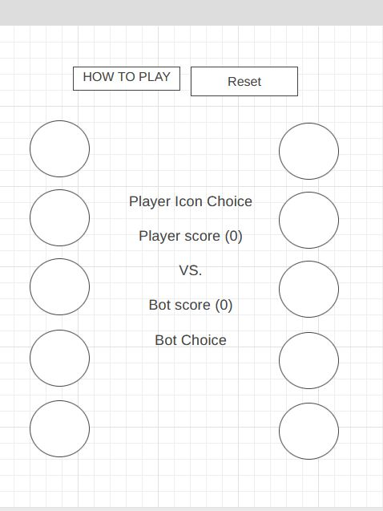
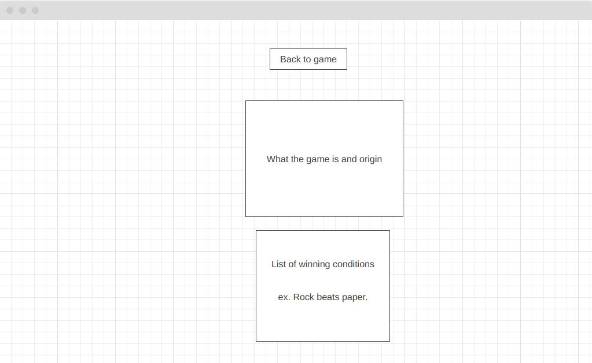

<h1>RPLSP (Rock, paper, Lizard, Scissors , Spock)</h1>

 
Live version [_here_](https://itchie1411.github.io/RPLSP/)

<h2>Table of Cotents </h2>
<li> General </li>
<li> Design </li>
<li> Pages </li>
<li> Testing and pain points</li>

<h2>General information</h2>
Rock Paper Lizard Scciors Spock, the game made famous by the Big Bang theory sitcom TV show. 
For my project, I wanted to build this version of the classic game; Rock, Paper, Scissors due to the winning and loosing conditions, which are a bit more complex than the classic version. 
I wanted to take on this challenge as being new to Javascript, I wanted to push myself more than what was covered in the current course. 
   
The game is very simple, select an icon and the bot or PC will then choose it's own icon at random - which in turn will then decide the winner!    
There is a maximum of 10 points to win, either the player (You) or the bot will win. If either win, the game will prompt a message stating who has won and will refresh with a new game. 
 

<h2>Design</h2>
The design of my project is very simple. I decisioned that for bigger monitors such as desktop / laptop that the icons for the game are to be spread across the screen to make it visually more appealing. While for mobile and tablet devices it is the opposite - the icons will be displayed vertically. 

The design of the icons to which the player selects as their choice where found by googling for references to the game, to which <a href='https://pngset.com/images/rock-paper-scissors-lizard-spock-is-a-funny-extension-clipart-rock-paper-scissors-network-hand-sphere-word-transparent-png-318140.png'>this image was found.</a>
I simply sliced each icon images from this newly found picture to give myself the follow:   
Rock:  

I created a very simple wiregrapic for both veritcle and horozontal views. 

<h3>Desktop view</h3>

<h3>Tablet and phone views</h3>

<h2>Pages</h2>
There is only 1 other page that needed to be created for the game project, a simple 'How to Play' or 'Rules' page, which is very simply put together by some p and li elements. 
There is also a simple button that returns the end user back to the main game page. 

 

<h2>Testing and pain points</h2>
Main testing and painpoints where found during the development of the Javascript file. 
   
During the development of this website, it became very clear during the building of the javascript file I noticed that this would be a challenge. 
Not only did I have to detect a users click and a selection of a icon, but would also have to generate a random decision from the bot to also pick a icon against the players for the game to work correctly. 
Finding the players Click wasn't the hard part, it was finding a solution to get the Bot to pick it's choice when the player did. I was able to get a random choice from the PC, but waiting for the players choice before the Bots random decision proved difficult. 
  
However, the solution which was just to nest the bot random choice function within the player Click function. This basically meant that the Bot was not to pick any icon to before the player choose theirs and worked perfectly.   

That being said, the most logical part of the JS code was next. Giving I had to find a solution to 5 choices of Rock, Paper, Lizard, Scissors, Spock and their winning and loosing conditions.
After many hours trying to find which solution on which approach would be best - I found that simply looping the conditions until true was easiest. Loop can be found within the <a href='assests/scripts/scripts.js'>JS file.</a>  

The next toughest sections for testing and was soon to be a pain point was to generate a point for either player or bot depending if they won or not. This coencided with my IF loop. I quickly learned after many, mnay trail and errors - that finding the score CLASS from the HTML file within Javascript, I could easily add a +1 to a variable that was assigned the number 0. This then meant that IF a player picked a icon and it beats the bot, (purpose of the IF loop) then +1 to the winner. 
This method of updating the scores also assisted in showing on screen what the player picked and what the BOT picked. This way, I could show why either the bot or player 
won giving their choice. 

<h2>Further testing</h2>
</h2> </a>
<li></ul>HTML</li>
Carried out on all pages of the website using the HTML validator <a href='https://validator.w3.org/'>W3C validator</a>

<li></ul>CSS</li>
Carried out also, using the <a href='https://jigsaw.w3.org/css-validator/'> Jigsaw CSS validator</a>
  

